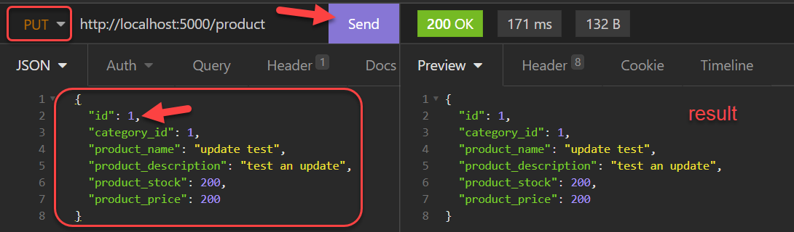
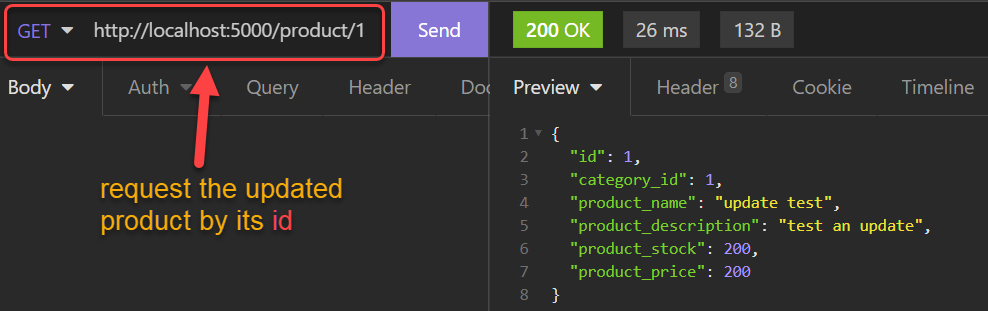
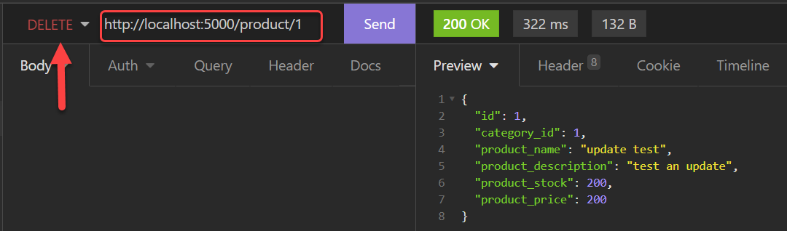

# 7.1 Web API & Database: Updating and deleting existing products

Enda Lee 2022

### Quick Start

1. Download or `fork` the code from this repository.
2. Open in VS Code.
2. copy `sample.env` to `.env` and configure for your database.
3. In a terminal run `npm install`
4. Start the application using `npm run dev`


## Introduction

This tutorial adds the server-side functionality for updating a product and deleting products. The features each requires a controller endpoint, a service function, and data access.

Some of the `create product` functionality added in the previous tutorial will be re-factored to support the new functions.

To get started, Download or `fork` the code from this repository and open in VS Code.


## Updating Products

 Updating an existing product is very similar to adding a new one but with some important differences:

1. Existing products already have an `id`.
2. Requests will use HTTP `PUT` instead of `POST` to differentiate the two requests.
3. The database will run an `update` instead of `insert`. Prisma will handle this in the data access layer but that will require a separate function.

### 1. Define the API endpoint

Add a new API Endpoint to **`productController.js`** to handle the update **`put`** request. Other than the **HTTP method**, it is the same as the`POST` endpoint.

```{.javascript .numberLines .lineAnchors}
// This endpoint is used to update existing products
// Note that this handles a PUT request (router.post)
// request body contains data
router.put('/', async(req, res) => {
  // read data request body, this will be the new product
  const updateProduct = req.body;
  
  // If data missing return 400
  if (typeof newProduct === "undefined") {
    res.statusMessage = "Bad Request - missing product data";
    res.status(400).json({ content: "error" });
  }
  // log the data to the console
  console.log('product data sent:\n', updateProduct);

  // Call productService to create the new product
  try {
    const result = await productService.addOrUpdateProduct(updateProduct);

    // Send response back to client
    res.json(result);

    // Catch and send errors
  } catch (err) {
    res.status(500);
    res.send(err.message);
  }
});
```


### 2. The Service

The controller endpoint above calls **`productService.addOrUpdateProduct(updateProduct)`**. This function replaces `productService.addNewProduct()` from the previous tutorial. Creating and Updating products are very similar and can be combined for simplicity.

 Here is the updated code, note the `if statement` decides on whether to call `createProduct` or `updateProduct` based on the `id` value.

```{.javascript .numberLines .lineAnchors}
// Add or update a product
// If product id == 0 then it is a new product
// Otherwise (if id > 0) then update 
async function addOrUpdateProduct(formProduct) {
  // declare variables
  let result;

  // Call the product validator - kept seperate to avoid clutter here
  let validatedProduct = productValidator.validateProduct(formProduct);

  // If validation returned a product object - save to database
  if (validatedProduct) {
    // insert or update?
    if (validatedProduct.id == 0) {
      // Insert
      result = await productData.createProduct(validatedProduct);
    } else {
      // update
      result = await productData.updateProduct(validatedProduct);
    }
  } else {
    // Product data failed validation
    result = { result: "error - invalid product" }; // log the result

    console.log("productService.createProduct(): form data validate failed");
  }

  return result;
}
```

#### Changes to product validation

The new combined create/ update also requires some changes to how product data is validated. See the **`validateProduct()`** function in **`productValidator()`**. 

1. Set default `productId = 0` in case it does not exist.
2. If the product data to be validated, contained in`formProduct`, includes an `id` then use that value.

Otherwise validation is same as before.

```{.javascript .numberLines .lineAnchors}
// Validate the body data, sent by the client, for a new product
// formProduct represents the data filled in a form
// It needs to be validated before using in gthe application
function validateProduct(formProduct) {
    // Declare constants and variables
    let validatedProduct;

    // new product has no id, initialise to 0
    let productId = 0;

    // debug to console - if no data
    if (formProduct === null) {
        console.log('validateNewProduct(): Parameter is null');
    }

    // Check if id field is included in the form object
    // if yes then assign it to productId
    if (formProduct.hasOwnProperty('id')) {
        productId = formProduct.id
    }

    // Validate form data for new product fields
    // Creating a product does not need a product id
    // Adding '' to the numeric values makes them strings for validation purposes ()
    // appending + '' to numbers as the validator only works with strings
    if (
        validator.isNumeric(productId + '', { no_symbols: true, allow_negatives: false }) &&
        validator.isNumeric(formProduct.category_id + '', { no_symbols: true, allow_negatives: false }) && 
        !validator.isEmpty(formProduct.product_name) && 
        !validator.isEmpty(formProduct.product_description) && 
        validator.isNumeric(formProduct.product_stock + '', { no_symbols: true, allow_negatives: false }) && 
        validator.isCurrency(formProduct.product_price + '', { no_symbols: true, allow_negatives: false }))
    {
        // Validation passed
        // create a new Product instance based on Product model object
        // no value for product id (passed as null)
        validatedProduct = new Product(
                Number(productId),
                Number(formProduct.category_id),
                // escape is to sanitize - it removes/ encodes any html tags
                validator.escape(formProduct.product_name),
                validator.escape(formProduct.product_description),
                Number(formProduct.product_stock),
                Number(formProduct.product_price)
            );
    } else {
        // debug
        console.log("validateNewProduct(): Validation failed");
    }
    // return new validated product object
    return validatedProduct;
}
```


### 3. Data Access

The **`updateProduct()`** function in **`productData.js`** uses`Prisma` to update our product in the database. The process is similar to creating/ inserting except that the product should already exist and have an `id`. The `where` clause uses the value of `product.id` to ensure that the correct product is updated.

```{.javascript .numberLines .lineAnchors}
// Update a product and return it
//
async function updateProduct(product) {
    // var for result
    let result;

    // execute the update via prisma
    try {
        // set the sql paramaters and execute
        result = await prisma.product.update({
            // Update the product with matching id
            where: {id: Number(product.id)},

            // updated product data
            data: {
                category_id: Number(product.category_id), 
                product_name: product.product_name, 
                product_description: product.product_description, 
                product_stock: Number(product.product_stock), 
                product_price: Number(product.product_price)
            },
        });

    // Catch and log errors to server side console 
    } catch (err) {
        console.log('DB Error - update product: ', err.message);
    } finally {

    }
    // return the query result (updated product)
    return result;
}
```


### 4. Test

Use [Insomnia](https://insomnia.rest/) to test the API. First make a `get` request to the API to get all products. Then make a **`put`** request to **update**, similar to:




The result should reflect the changes made by the update, double check with a `get` request for the `product` by its `id`.




## Deleting Products

Delete is the last of the **CRUD** functions (`C`reate, `R`ead, `U`pdate, `D`elete) we will implement in the API.

Requesting a product delete works like request by `id` with different outcomes. As usual, the API endpoint uses an appropriate HTTP method, in this case **`DELETE`** to identify the request type.

### 1. Endpoint for `delete`

This endpoint should be added to **`productController.js`**. Its job is to handle the request, call the service, and send back a response.

```{.javascript .numberLines .lineAnchors}
// This endpoint will delete a product by id
router.delete('/:id', async(req, res) => {

  // Try to get data and return
  try {
      // Get result from the product service
      // passing the value from req.params.id
      const result = await productService.deleteProduct(req.params.id);

      // Send a  response
      res.json(result);

  // Handle server errors    
  } catch (err) {
      res.status(500);
      res.send(err.message);   
  }
});
```


### 2. Service function to `deleteProduct(id)`

The service function will accept the request to delete a product by id, validate, and then call data access to perform the delete in the database. This function should be defined in **`productService.js`**.

```{.javascript .numberLines .lineAnchors}
// Function to delete product by id
//
async function deleteProduct(id) {
  // validate the id
  const delId = validate.validateId(id)
  if (delId) {
    // Call the repository function to get product matching id
    const result = await productData.deleteProductById(delId);

    // return the result
    return result;

  } else {
    return {"result" : "Error:Invalid product id"};
  }
}
```


### 3. Data Access Layer - Delete a product

Define **`deleteProductById(id)`**  in **`productData.js`**

This function uses `prisma` to delete the product with a matching `id` - set in the `where` clause.

```{.javascript .numberLines .lineAnchors}
// Delete product by id from DB
//
async function deleteProductById(id) {
    let result;
    try {
        // set id parameter value in where clause
        result = await prisma.product.delete({
            where: {id: Number(id)}
        });
        console.log('delete result: ', result);

    // Catch and log errors to server side console 
    } catch (err) {
        console.log('DB Error - delete: ', err.message);
    } finally {

    }
    // return the query result
    return result;
}
```


### 4. Test Delete

Use insomnia to test the delete function. Choose a valid product id then make a request to `delete`

The result will show the product which has been deleted (if any).




Verify the delete by making a `get` request for that product by its `id`. The result should be empty/ null as the deleted product will not be found.


## Exercises

Add functionality for the following:

**1.**   Complete the CRUD functionality for `Category`


------

Enda Lee 2022
